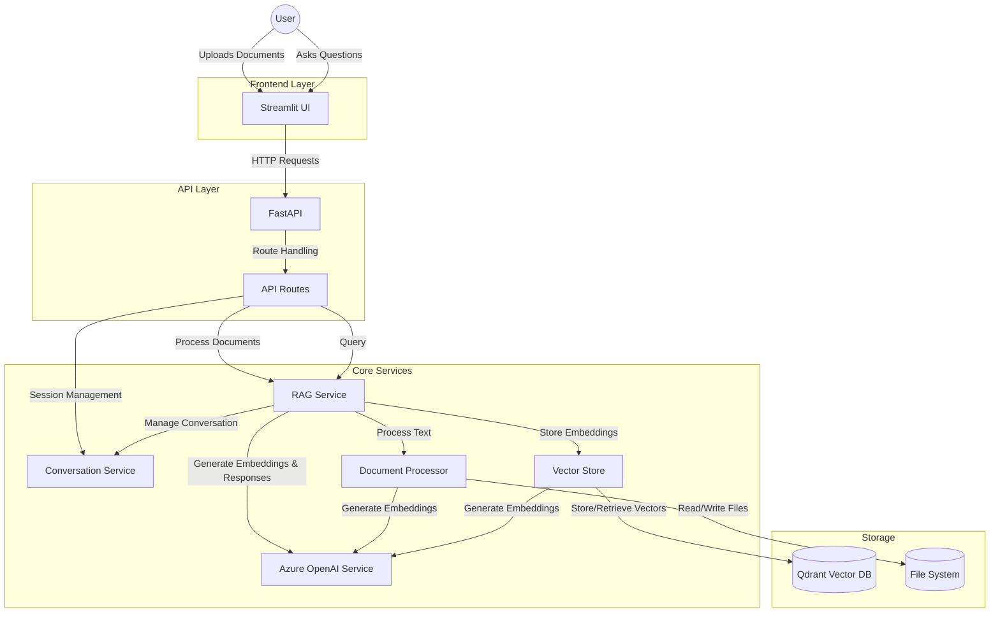
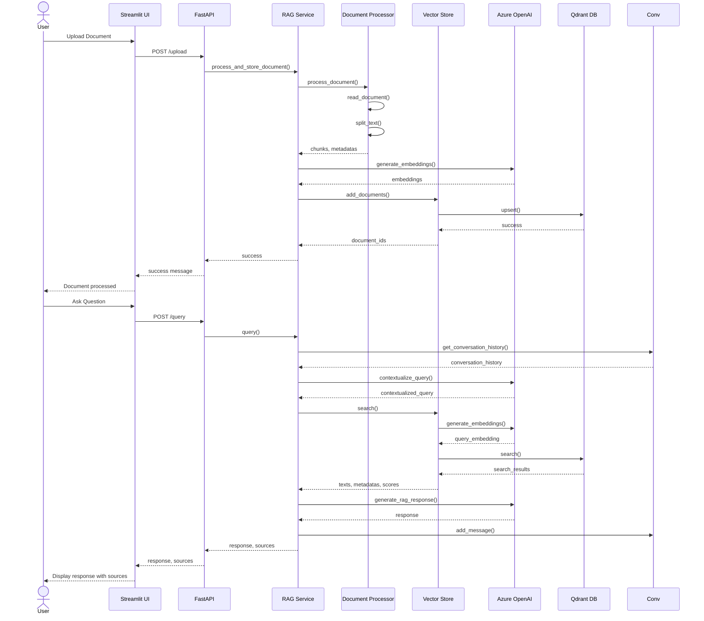
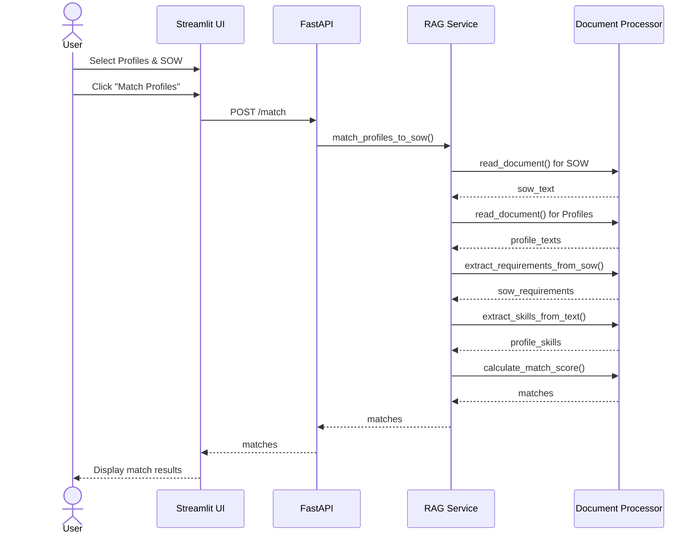
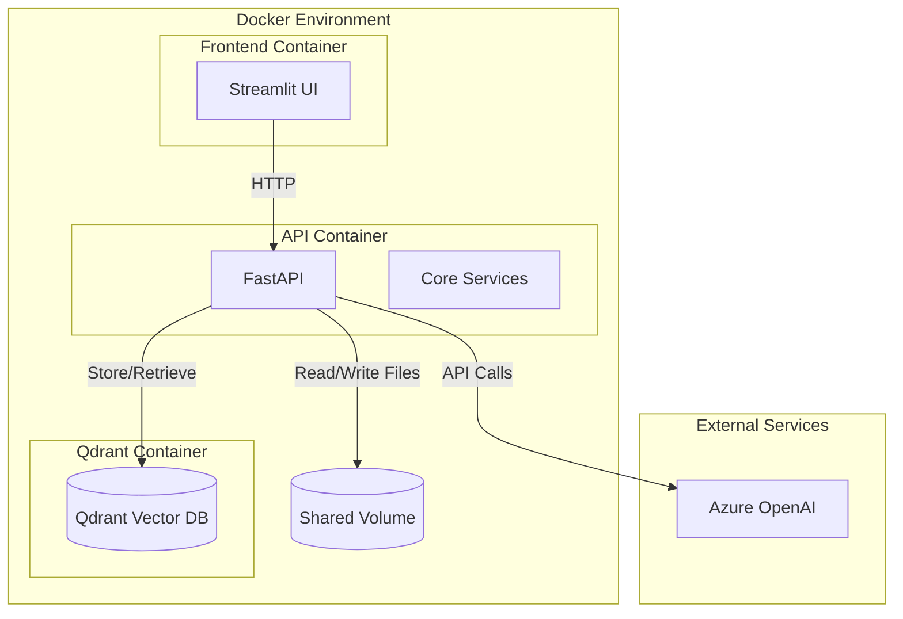

# RAG Chatbot Architecture

This document outlines the architecture of our Retrieval Augmented Generation (RAG) chatbot built using Azure OpenAI.

## Architecture Diagram

## Component Descriptions

### Frontend Layer
- **Streamlit UI**: Provides a user-friendly interface for document upload, chat interactions, and profile matching.

### API Layer
- **FastAPI**: High-performance web framework for building APIs.
- **API Routes**: Endpoints for session management, document processing, querying, and profile matching.

### Core Services
- **RAG Service**: Orchestrates the RAG workflow, connecting document processing, vector storage, and response generation.
- **Conversation Service**: Manages chat sessions and conversation history.
- **Document Processor**: Handles document reading, text extraction, and chunking.
- **Vector Store**: Manages vector embeddings storage and retrieval.
- **Azure OpenAI Service**: Interfaces with Azure OpenAI for embeddings and chat completions.

### Storage
- **Qdrant Vector DB**: Stores and indexes document embeddings for semantic search.
- **File System**: Stores uploaded documents.

## RAG Workflow

## Profile Matching Workflow

## Deployment Architecture

## Key Features

1. **Document Processing**
   - Support for PDF, DOCX, and TXT files
   - Intelligent text chunking with configurable size and overlap

2. **Semantic Search**
   - Vector embeddings using Azure OpenAI
   - Efficient similarity search with Qdrant

3. **Conversation Management**
   - Session-based conversations
   - Follow-up question handling with context

4. **Profile Matching**
   - Skill extraction and matching
   - Scoring based on requirement alignment

5. **User Interface**
   - Document upload and management
   - Interactive chat with source references
   - Profile matching visualization

         